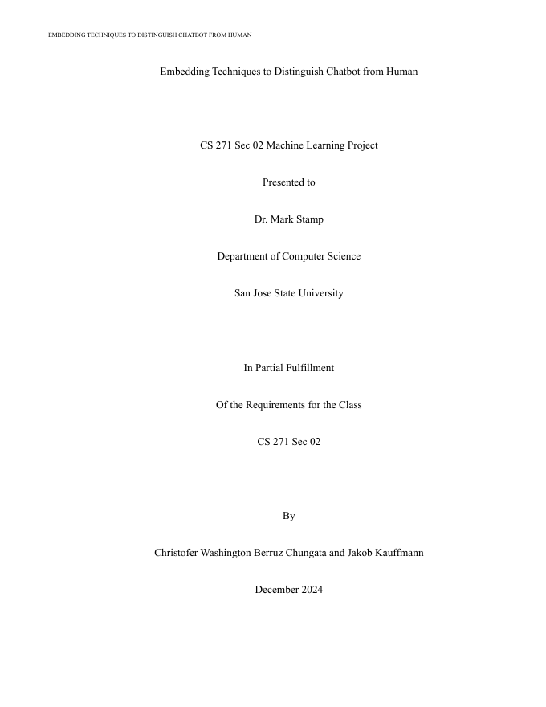

# AI-Generated Text Detection with Sentence Embeddings

Detects whether a passage was written by a person or generated by an LLM. The project embeds whole passages with SBERT, InferSent, or the Universal Sentence Encoder and compares an MLP, a CNN, and AdaBoost as classifiers. For the CNN, a Vector-to-Grayscale (V2G) transform turns each embedding into an image.

**CS 271: Machine Learning** (Dr. Mark Stamp) · San José State University · Fall 2024

**Team:** Christofer Berruz ([@ChristoferBerruz](https://github.com/ChristoferBerruz)) and Jakob Kauffmann ([@JakobKauffmann](https://github.com/JakobKauffmann)). This repository is a fork of the team repository, [ChristoferBerruz/cs271-mlproject](https://github.com/ChristoferBerruz/cs271-mlproject), so the full commit history is preserved.

<a href="docs/report.pdf"></a>

**[Read the report (PDF)](docs/report.pdf)**

## What we did

- **Data:** WikiHow articles written by people, GPT-generated articles, and 50,000 articles we generated with Llama 3.2 3B through Ollama from the same WikiHow prompts.
- **Tasks:** Human vs. GPT, Human vs. Llama, and Human vs. mixed chatbot text (GPT and Llama).
- **Embeddings:** SBERT (`all-MiniLM-L6-v2`), InferSent, and the Universal Sentence Encoder, with PCA for dimensionality reduction.
- **Models:** an MLP, AdaBoost, and a CNN trained on V2G images resized to 100 × 100.
- **Experiment grid:** 3 tasks × 3 embeddings × 3 models, tracking accuracy, precision, recall, and F1 for every run.

## Results

From the report:

- The MLP reached perfect accuracy, precision, and recall on every task and embedding.
- The CNN exceeded 0.999 on the binary tasks but lost some precision when separating GPT from Llama text.
- AdaBoost handled the binary tasks and struggled in the multiclass setting.

All text comes from WikiHow-style prompts, so these scores describe that setting. The report does not test other domains or other generators.

## Repository layout

```
mlproject/         Package: data processing, embeddings, V2G images, models, experiment entry point
tests/             pytest checks for model training
visualization/     Scripts that generate the report figures
InferSent/         InferSent encoder definition (Facebook Research)
run_adaboost.zsh   Example batch run
docs/              Project report
```

## Setup

This repository is intended to be self-contained and be able to run in Google Colaboratory
with CUDA accelerators. As a result, `conda` is the preferred mechanism
of installing the dependencies. Install [Anaconda or miniconda](https://docs.anaconda.com/miniconda/).

Once conda is installed, simply create an environment using

```
conda env create -f conda_environment.yml
```

InferSent needs the pretrained `infersent2.pkl` encoder and the fastText `crawl-300d-2M.vec` vectors. Set their paths in `mlproject/embeddings.py` (the defaults point at the team's Google Drive).

The experiment entry point is `python -m mlproject` (see `mlproject/main.py`).
